## 简述
这是博客内容管理系统，利用react + typescript + react-router + hooks + ant design编写而成。具体模块有

1. 登录、退出
2. 文章管理
   - 文章修改，删除
   - 添加文章
   - 草稿箱
3. 标签管理
   - 新增、修改、删除标签
4. 留言墙管理
   - 新增、修改、删除留言
5. 文章评论管理
   - 新增、修改、删除留言
6. 项目管理
   - 新增、修改、删除留言
7. 音乐管理
   - 新增、修改、删除音乐
   - 上传音乐文件、海报到七牛云

## 相关链接

博客地址：[naice-blog](https://github.com/naihe138/naice-blog)

博客管理：[naice-blog-admin](https://github.com/naihe138/naice-blog-admin)

博客后台：[node-koa](https://github.com/naihe138/naice-blog-koa)


### 后台相关截图：


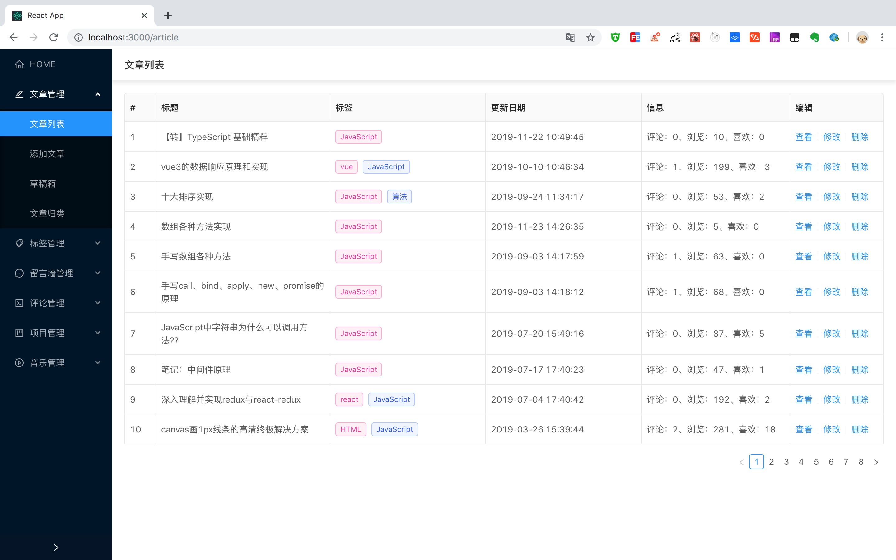

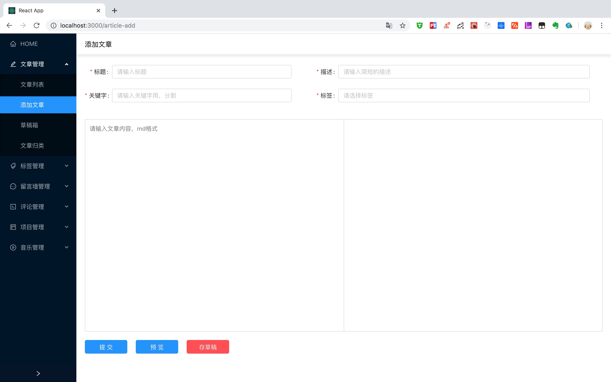

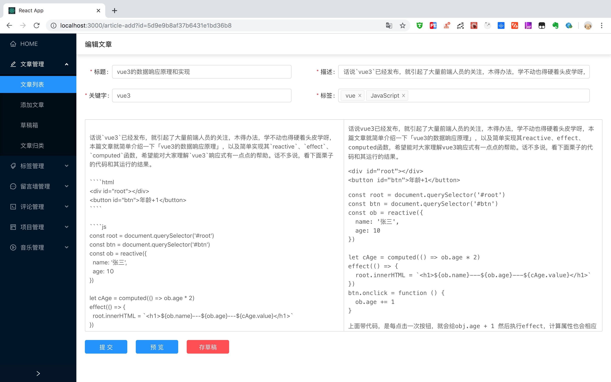

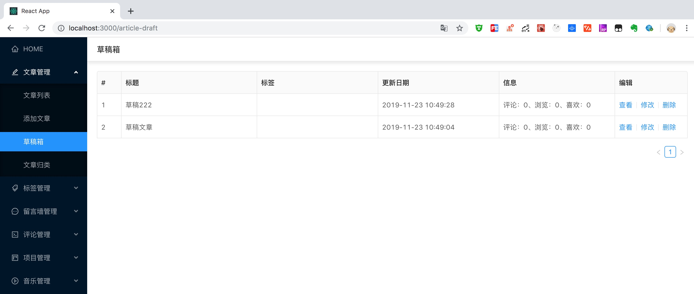

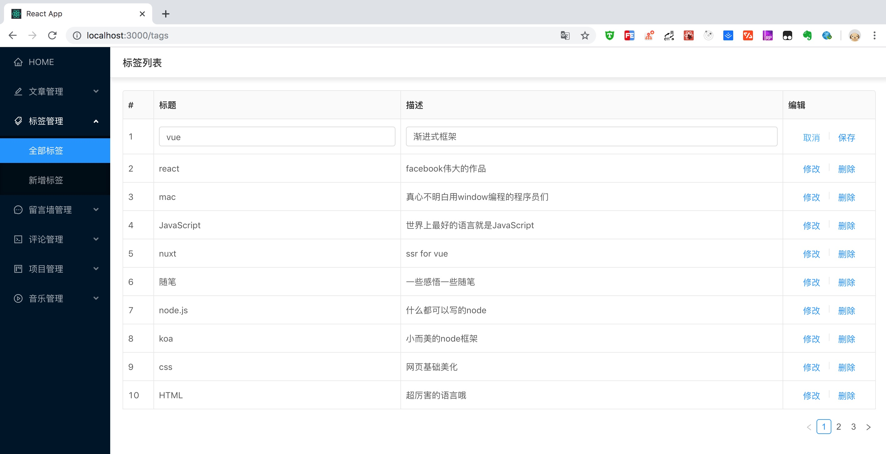

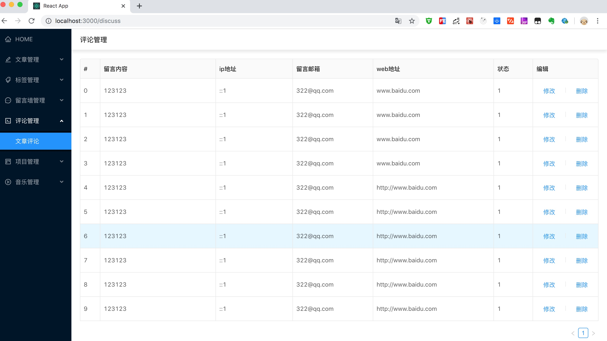

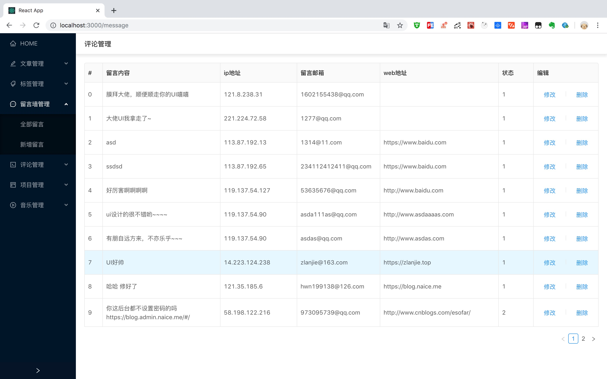

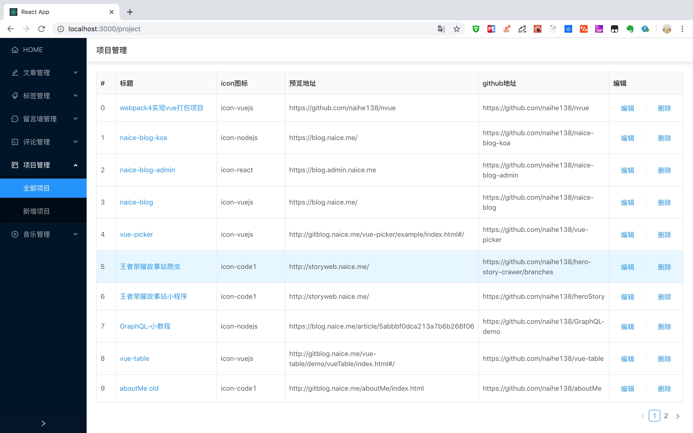

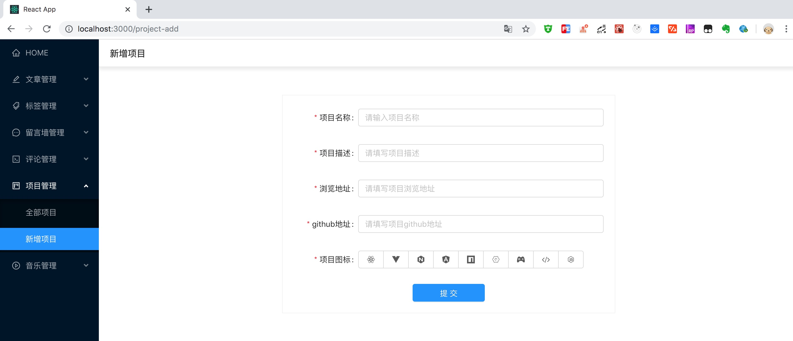

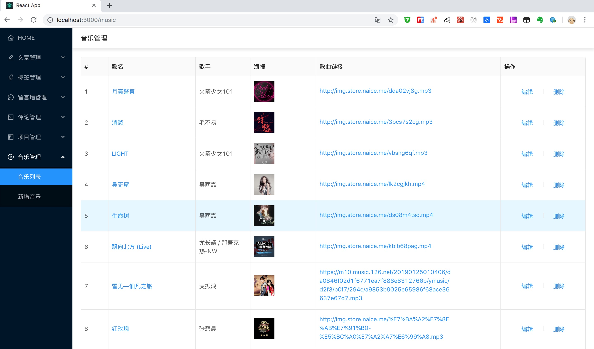

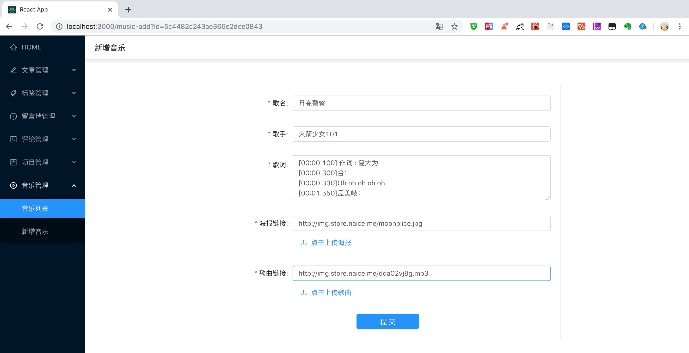


### 相关技术栈：

+ react + redux + react-router + ant design
+ token控制

### server

+ node + koa + mongoose
+ 鉴别参数是否正确
+ 登录权限jwt
+ 百度sro推送，邮件通知
+ pm2自动化部署
+ nginx + ssl + http2
+ 缓存
+ ....


### 未来可能加入

+ ~~网易云音乐~~
+ 移动适配
+ 页面数据可视化统计
+ react-native
+ ....


#### Clone
````
git clone git@github.com:naihe138/naice-blog-admin.git

````

#### install
````
yarn

````

#### dev

````

npm run start

````

#### build

````
npm run build
````


如在浏览中遇到任何的bug，请留言我，我会第一时间修复，就此先谢谢
